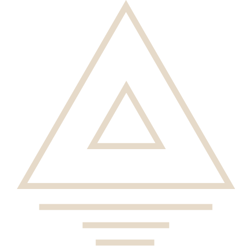
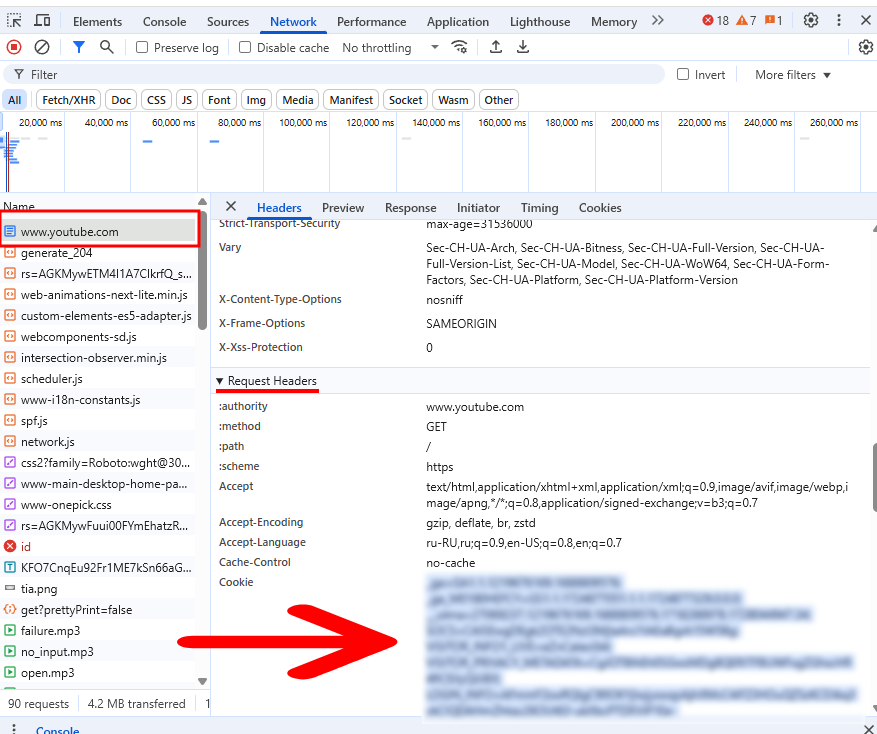

  

<h1 align="center">Recall</h1>

**Recall** is a cross-platform music downloader that lets you save music from **YouTube** (**Spotify** and **SoundCloud** coming soon.)

Whether you're building a music library or just want offline access to your favorite songs, Recall simplifies the process with smart organization and an easy-to-use interface.

       

## How to install

Go to [release page](https://github.com/Astisek/recall-app/releases/) and download latest version

## How to set cookie

1. Go to YouTube
2. Open DevTools (F12 in Chrome)
3. Switch to the Network tab
4. Refresh the page
5. Click on the request to www.youtube.com
6. Scroll down to the request headers
7. Copy the value of the Cookie header
8. Paste the value into the YouTube Cookie field in the app settings and save

## FAQ

**Q:** The server responded with a non 2xx status code
**A:** Set or reset the [cookies in the settings](#how-to-set-cookie).

## For v1.0

| Feature                                        | Done ✅ |
| ---------------------------------------------- | ------- |
| Download music from YouTube                    | ✅      |
| Playlist support                               |         |
| Download music from Soundcloud                 |         |
| Download music from Spotify                    |         |
| Save to directory                              | ✅      |
| Directory Sync between devices (Authorization) |         |

## Dev mode

1. Clone the repository
2. Run `pnpm install`
3. Run `pnpm dev`
